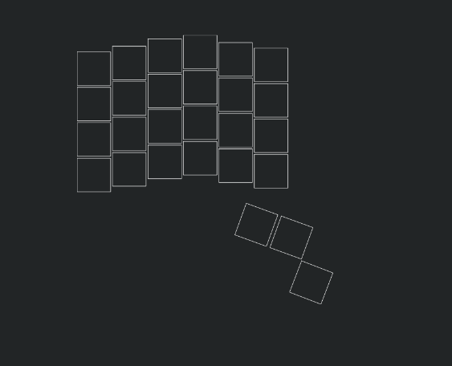

# Flow
A open source split mechanical keyboard powered by ergogen and kicad

# Features
- Hotswappable with mx-style switches
## TODO
- [x] Finish layout (ergogen)
- [x] Make keyboard outline (ergogen) 
- [x] Fix microcontroller orientation (ergogen)
- [ ] Create pcb (ergogen)
- [ ] Make screw holes in pcb
- [ ] Add stabilizers in pcb
- [ ] Create case  
- [x] Add trrs jack
