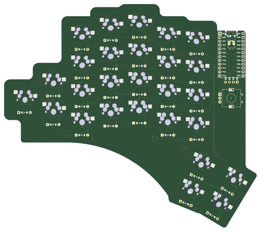

# Flow
An open source split mechanical keyboard powered by [Ergogen](https://github.com/ergogen/ergogen) and kicad
## Design

# Updates
- Finished routing the pcb
- Finished making plate
- Going to start working on the case

# Features
- Hotswappable with mx-style switches
- Flippable PCB
- 4 Key Thumb Cluster
- Oled
- Rotary encoder
- Wireless
## TODO
- [x] Finish layout (ergogen)
- [x] Make keyboard outline (ergogen) 
- [x] Create pcb (ergogen)
- [x] Route everything
- [ ] Create case  
- [X] Wireless
- [ ] ZMK Firmware
- [ ] Buy and build keyboard :)

# Goals
- Have hotswap with choc, kailh box etc.
- Be wireless
- Have RGB if I can actually configure it properly
