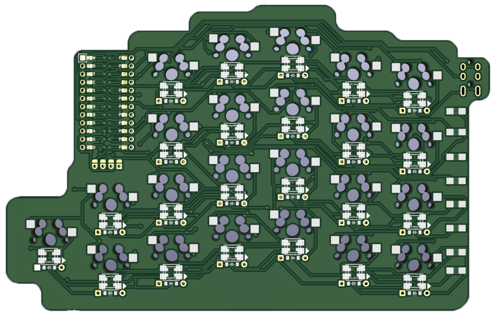

# Flow
An open source split mechanical keyboard powered by [Ergogen](https://github.com/ergogen/ergogen) and kicad
## WARNING:
The pcb has not been tested as of 2022/01/31. 
If you are going to print the pcb (tented) you must buy each part of the keyboard separately being the main body, thumb cluster and bridge

# Features (So far)
- Hotswappable with mx-style switches
- Flippable PCB
- Thumb cluster with 4 keys
- Oled (V2)

# Updates
- Rebuilding Ergogen Config
- F*** RGB I'm going wireless and OLED
## TODO
- [x] Finish layout (ergogen)
- [x] Make keyboard outline (ergogen) 
- [x] Create pcb (ergogen)
- [ ] Wire everything
- [ ] Create case  
- [ ] Wireless
- [ ] QMK Firmware
- [ ] Print and build keyboard :)

# Goals
- Have hotswap with choc, kailh box etc.
- Be wireless
- Have RGB if I can actually configure it properly
